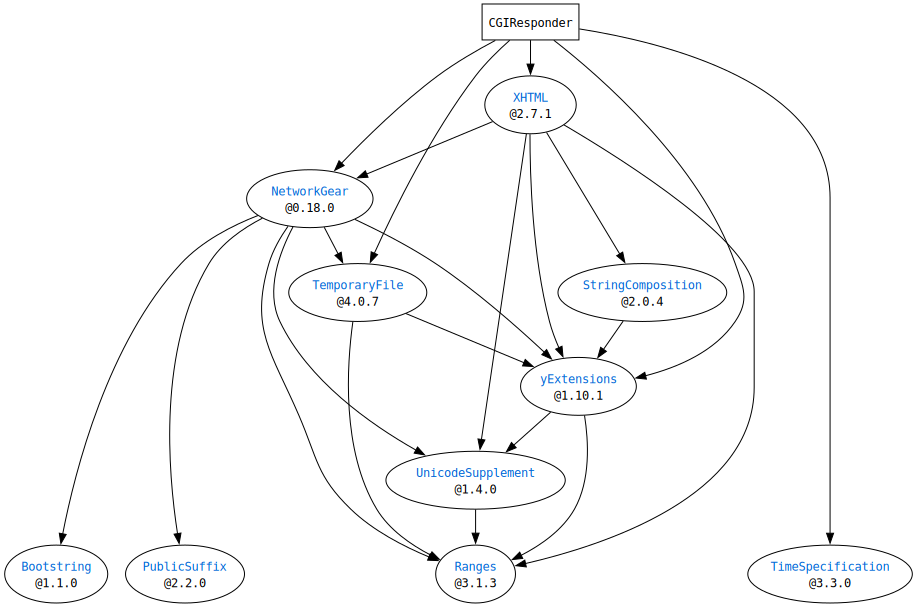

# What is `SwiftCGIResponder`?
`SwiftCGIResponder` will provide miscellaneous functions you may use when you write CGI programs in Swift.  
It's an experimental library under development, and useless as of now.

# Requirements
* Swift 5
  * CoreFoundation
  * Foundation
* macOS >= 10.15 or Linux
* HTTP server software (e.g. Apache or similar software)

## Dependencies




# Usage

```Swift
import CGIResponder

var responder = CGIResponder()
responder.status = .ok
responder.contentType = ContentType(pathExtension:.txt, parameters:["charset":"UTF-8"])!
responder.content = .string("Hello, World!\n", encoding:.utf8)
try! responder.respond()

// -- Output --
// Status: 200 OK
// Content-Type: text/plain; charset=UTF-8
//
// Hello, World!
//
```

You may see other samples in [SwiftCGIResponderSamples](https://github.com/YOCKOW/SwiftCGIResponderSamples).

# How to install

You can use [Swift Package Manager](https://github.com/apple/swift-package-manager) easily to import `CGIResponder` to your project.

## Example of `Package.swift`

```Swift
// swift-tools-version:5.1
// The swift-tools-version declares the minimum version of Swift required to build this package.

import PackageDescription

let package = Package(
  name: "MyCGI",
  products: [
    // Products define the executables and libraries produced by a package, and make them visible to other packages.
    .executable(name: "cgi1", targets: ["CGI1"]),
    .executable(name: "cgi2", targets: ["CGI2"]),
    .library(name: "CGIManager", type:.dynamic, targets: ["CGIManager"]),
  ],
  dependencies: [
    // Dependencies declare other packages that this package depends on.
    .package(url:"https://github.com/YOCKOW/SwiftNetworkGear.git", .branch("master")),
    .package(url:"https://github.com/YOCKOW/SwiftCGIResponder.git", .branch("master")),
  ],
  targets: [
    // Targets are the basic building blocks of a package. A target can define a module or a test suite.
    // Targets can depend on other targets in this package, and on products in packages which this package depends on.
    .target(name: "CGI1", dependencies:["SwiftCGIResponder", "SwiftNetworkGear"]),
    .target(name: "CGI2", dependencies:["SwiftCGIResponder", "SwiftNetworkGear"]),
    .target(name: "CGIManager", dependencies:["SwiftCGIResponder"]),
    .testTarget(name: "CGIManagerTests", dependencies: ["CGIManager"]),
  ]
)
```


# License
MIT License.  
See "LICENSE.txt" for more information.
